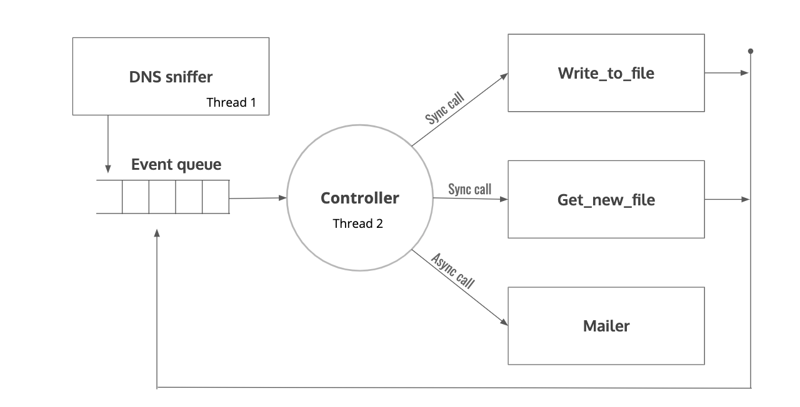

# DNS-monitor
DNS sniffer and mailer using the event-driven architecture.

Activity monitoring software uses keys strokes. They are hard to design and less secure [Captures sensitive information too]. We gave a shot on this with our idea. 
  
DNS packets resolve URLs to IPs. The DNS packet contains the website URL. So, by sniffing the DNS packets, the websites visited could be logged. Even the victim can't escape by using incognito/private mode :). All DNS packets have the destination port set to 53. A sniffer sniffing outgoing packets whose destination port is 53 provides all DNS packets. Apart from packet sniffing, our program should keep a persistent log and mail them regularly.
  
<b>Abstract Software Design</b>
 
As mentioned above, the software has three main functionalities.
DNS sniffer
Logger
Mailer
Scapy's sniffer function implements the "DNS sniffer" component. The "Logger" component writes the logs to the disk through files. Here a condition is made that a file's size is limited. If the limit exceeded, a new log file starts logging the data and the old log to the given E-Mail address by the "Mailer" component. These configurations are hard-coded in the configuration file [config.cfg].
  
<b>Event Driven architecture</b> 
The architecture and communication between modules are easy to plan if implemented in Event-Driven. Event-Driven in simple terms requests pushed to a queue. The main controller pops the queue and calls the necessary function. It saves a lot of computation with expense in increased latency to respond to request compared to the thread-per request model. But, latency is not a concern here, we want our program to run with minimum no of threads. In other words, minimum computation. 
 
The following shows the diagrammatic representation of the architecture.
 

  
<i>Components mentioned</i> 
DNS sniffer 
Event queue 
The controller 
Write_to_file 
Get_new_file 
Mailer 
  
<b>DNS sniffer</b> 
Implemented with "scapy", sniffs for DNS packets. If got, it enques the URL in event queue with format [1,URL]. The format will be explained in later part. DNS sniffer is executed as sepereate thread.
  
<b>Event queue</b> 
Event queue is the list datastructure where outputs from the modules are enqued here. All request are served in FIFO order. The elements in Event queue has following format <i><Event_id,Message></i>. Event_id helps controller to call respective function.
  
<b>The controller</b> 
  Controller <i>[Sort of like demux]</i> pops request from event_queue calls the function assigned for respective Event_id and pass the message as argument. It runs as seperate thread. Following are Event_id and respective function pair.
(0,write_to_file),(1,get_new_file),(2,mailer). <i>Mailer</i> is an async call, since its a rare call and independent from other modules. That is, the pointer returns to the controller as soon as the function starts executing, it won't wait till function finishes. Whereas <i>write_to_file</i> and <i>get_new_file</i> is synchronous. Since common resourse exist among those components.
  
<b>Write to file</b> 
It gets the URL as argument and writes it to the file. It checks current file size if exceeded it enques <i>File_change</i> request to the event_queue.
  
<b>Get new file</b> 
It creates new log file and change file_pointer to the new file. It enques <i>Mail</i> request along with log file to be mailed. 
  
<b>Mailer</b>
 
Just mails the file to specified E-mail address.
 
<b>Conclusion</b>
 
Above description only provides the overall picture of the program. Several mutexs are used to avoid over population of Event queue. Global variable initialization is done by reading contents from config file. Look code for complete understanding.
  
<b>Enhancements</b>
 
The design of controller should be enchanced to batch-up similar request for improved efficency. For example, the <b>write to file</b> could be batched.
